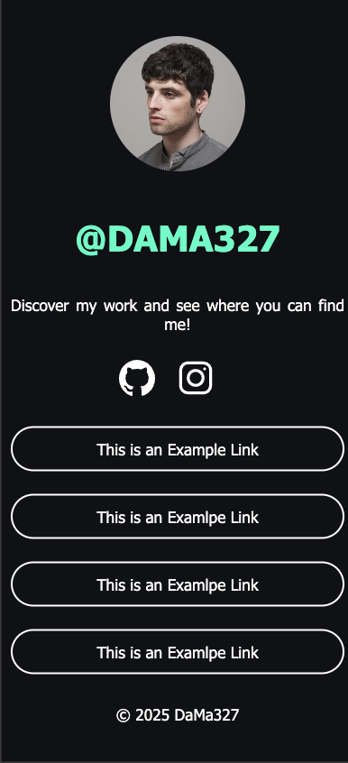

# Linktree Klon

Ein einfacher **Linktree-Klon**, der es Nutzern ermöglicht, mehrere Links auf einer einzigen Seite zu teilen. Ideal für die Nutzung auf Social Media Profilen, um schnell und unkompliziert auf verschiedene Links zuzugreifen.

## Funktionen

- **Mehrere Links**: Ermöglicht das Hinzufügen mehrerer Links auf einer Seite.
- **Klarer und einfach zu verstehender Aufbau**: Schlichtes Design, das die Nutzer nicht überfordert.
- **Responsive Design**: Optimiert für die Ansicht auf Desktop- und Mobilgeräten.

## Vorschau



## Technologien

- **HTML**: Struktur der Seite.
- **CSS**: Gestaltung und Layout.
  - Flexbox für die Zentrierung und Anordnung der Links.
  - Anpassung des Designs für verschiedene Bildschirmgrößen.

## Installation

### 1. Repository klonen

```bash
git clone https://github.com/DanMaDev327/LinktreeClone.git
```
